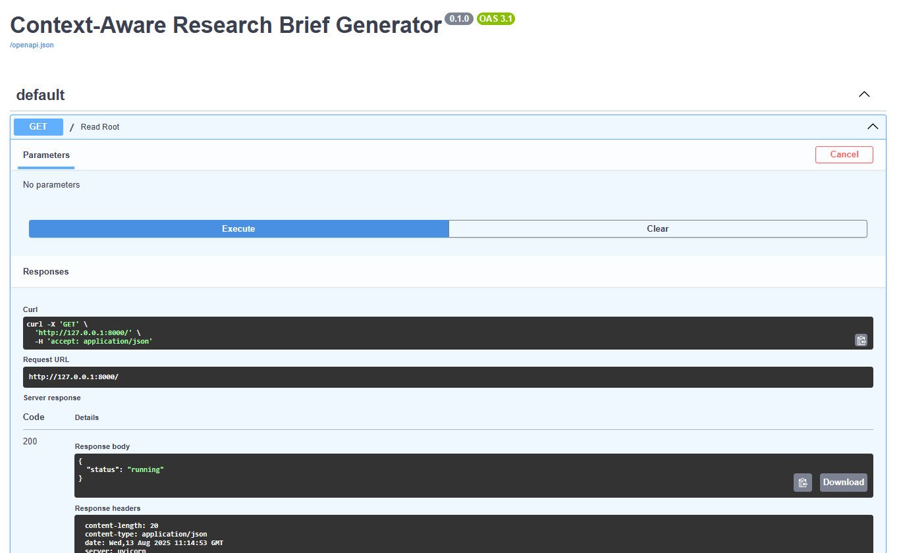

# ai_intern_atomicads
text
# Context-Aware Research Brief Generator

## Objective
Generate structured, evidence-linked research briefs using LangGraph and LangChain, supporting follow-up queries with context summarization.

---

## Architecture Overview

- **LangGraph** orchestrates workflow with nodes:
  - Context summarization
  - Planning
  - Search
  - Content fetching
  - Per-source summarization
  - Synthesis
  - Post-processing
- **LangChain** handles LLM calls, tool integration, and validation.
- Output data uses **Pydantic schemas** for validation.
- Provides both a **FastAPI HTTP API** and a **CLI**.
- Deployed on **Render** with Python 3.12.

  
*(Place your actual architecture diagram image in the `docs/` folder)*

---

## How to Run Locally

### 1. Clone the repository

> **Command (run in PowerShell or VS Code terminal):**
git clone https://github.com/promptedbyesha/ai_intern_atomicads.git
cd ai_intern_atomicads

### 2. Set up Python virtual environment and install dependencies

> **Commands (run in PowerShell or VS Code terminal):**
python -m venv venv

On Windows PowerShell:
.\venv\Scripts\Activate.ps1

On macOS/Linux Terminal:
source venv/bin/activate

pip install -r requirements.txt

### 3. Run the FastAPI server locally

> **Command (run in PowerShell or VS Code terminal):**
uvicorn app.server:app --reload

> **Expected output (do NOT run but observe this when running above command):**
INFO: Started server process [12345]
INFO: Waiting for application startup.
INFO: Application startup complete.
INFO: Uvicorn running on http://127.0.0.1:8000 (Press CTRL+C to quit)

### 4. Test the API via Swagger UI

- Open your browser and visit:  
  `http://127.0.0.1:8000/docs`

- Locate the **POST /brief** endpoint.

- Click **Try it out**, enter the example JSON request:
{
"topic": "AI in healthcare",
"depth": 2,
"follow_up": false,
"user_id": "123"
}

- Click **Execute**.

> **Expected successful response:**
{
"topic": "AI in healthcare",
"plan": {
"steps": [
"Step 1 for research on AI in healthcare",
"Step 2 for research on AI in healthcare"
]
},
"sources": [
{
"source_url": "https://example.com/AI_in_healthcare_article_1",
"summary": "Summary for https://example.com/AI_in_healthcare_article_1"
},
{
"source_url": "https://example.com/AI_in_healthcare_article_2",
"summary": "Summary for https://example.com/AI_in_healthcare_article_2"
}
],
"references": [
"https://example.com/AI_in_healthcare_article_1",
"https://example.com/AI_in_healthcare_article_2"
]
}

---

## CLI Usage

Run the brief generator locally via command line:

> **Command (run in PowerShell or VS Code terminal inside project folder):**
python app/cli.py brief "AI in healthcare" --depth 2

text

> **Expected CLI output:**
{
"topic": "AI in healthcare",
"plan": {
"steps": [
"Step 1 for research on AI in healthcare",
"Step 2 for research on AI in healthcare"
]
},
"sources": [
{
"source_url": "https://example.com/AI_in_healthcare_article_1",
"summary": "Summary for https://example.com/AI_in_healthcare_article_1"
},
{
"source_url": "https://example.com/AI_in_healthcare_article_2",
"summary": "Summary for https://example.com/AI_in_healthcare_article_2"
}
],
"references": [
"https://example.com/AI_in_healthcare_article_1",
"https://example.com/AI_in_healthcare_article_2"
]
}

---

## Deployment Instructions

### Deploy on Render

1. Create a file named `runtime.txt` in your project root with this **file content** (not a command):

> **File: runtime.txt**
python-3.12.2

2. Push your code to GitHub:

> **Commands (run in PowerShell or VS Code terminal):**
git add .
git commit -m "Ready for Render deployment"
git push

3. On Render dashboard:

- Link your GitHub repo and branch.
- Enable **Auto-Deploy** in Service settings.
- Set environment variables if needed.
- Confirm build command:

> **Command string in Render dashboard:**
pip install --upgrade pip setuptools wheel && pip install -r requirements.txt

- Confirm start command:

> **Command string in Render dashboard:**
uvicorn app.server:app --host 0.0.0.0 --port 10000

4. Wait for Render to automatically build and deploy your app.

5. Test your deployed API docs at:

https://your-service-name.onrender.com/docs

---

## Running Tests

Run unit tests from the project root folder:

> **Command (in PowerShell or VS Code terminal):**
pytest

---

## Additional Notes

- Your app’s source code is in the `app/` folder (**code files here, not commands**).
- Use Python 3.12 locally and on Render to avoid dependency version conflicts.
- Setup `.env.example` file with any required environment variables.
- Document well for clarity and easy setup.

---

## License

Distributed under the MIT License.

---

## Demo Usage Screenshots

*(Add screenshots of Swagger UI testing, CLI outputs, and Render deployment logs in your `docs/` folder and link here)*

---

## Summary Table of Commands and Usage Context

| Task                         | Command / Code Example                                           | Run Where                  | Expected Outcome                             |
|------------------------------|-----------------------------------------------------------------|----------------------------|----------------------------------------------|
| Clone repo                   | `git clone https://github.com/promptedbyesha/ai_intern_atomicads.git` | PowerShell / VS Code terminal | Project copied locally                        |
| Set up env & install deps    | `python -m venv venv` + `pip install -r requirements.txt`       | PowerShell / VS Code terminal | Virtual env created, dependencies installed  |
| Run API server               | `uvicorn app.server:app --reload`                               | PowerShell / VS Code terminal | API running on http://127.0.0.1:8000          |
| Test API via Swagger         | Open `http://127.0.0.1:8000/docs` in browser                    | Browser                    | Interactive API docs and endpoint testing    |
| Run CLI                     | `python app/cli.py brief "topic" --depth 2`                     | PowerShell / VS Code terminal | Brief JSON printed in terminal                 |
| Deploy to Render            | Git push after adding `runtime.txt`                             | PowerShell / VS Code terminal | Auto-deploy triggered on Render               |
| Monitor Render Logs         | Use Render Dashboard                                            | Browser                    | Deployment status and logs                     |

---
## Architecture Diagram

The following diagram illustrates the overall architecture of the Context-Aware Research Brief Generator system:

- LangGraph workflow nodes: context summarization, planning, search, content fetching, per-source summarization, synthesis, post-processing.
- Integration with LangChain for model calls, validation, and external tool usage.
- API (FastAPI) and CLI interfaces to interact with the system.
- External memory or persistence layer for user query history.
- Deployment environment on Render with Python 3.12 runtime.

## Demo Usage Screenshots

### API Swagger UI Test

This screenshot shows a successful POST request to the `/brief` endpoint via Swagger UI, with the example input and output visible.

---

### CLI Output

Below is a screenshot displaying the CLI output after running the brief generator command (e.g., `python app/cli.py brief "AI in healthcare" --depth 2`) in your terminal, showing the structured JSON response.

---

### Render Deployment Logs

This screenshot highlights the Render deployment dashboard, confirming a successful build and deployment of your application.

---

### Additional Demo Screenshot

An additional screenshot for documentation, such as testing, feature confirmation, or another relevant usage scenario.

## Limitations and Future Work

- The current system uses placeholder logic in LangGraph nodes; full LangChain integration and LLM-driven processing are next steps.
- User history and context summarization are implemented with in-memory or basic mechanisms; persistent storage would enhance multi-session continuity.
- Error handling and retry logic in nodes can be improved for production-grade robustness.
- Deployment on Render works well for prototype; further scalability and cost optimization could be explored.
- Future enhancements include adding a user-friendly web interface and advanced observability with detailed tracing dashboards.

